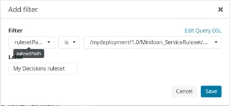
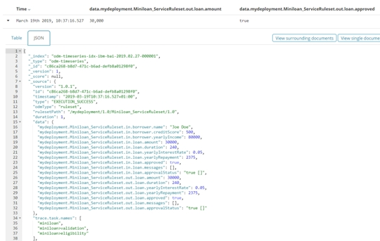
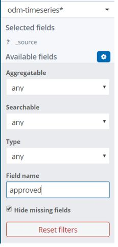
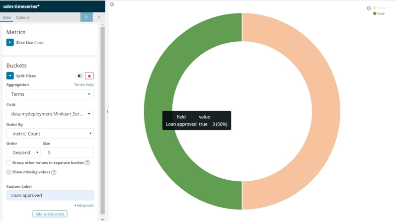
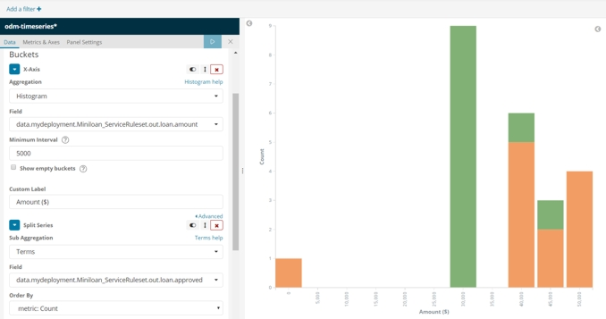
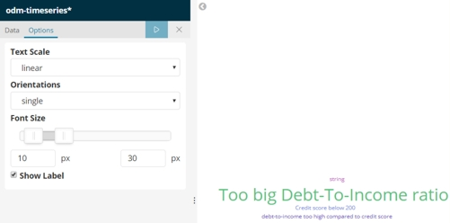

# Task 5: Making a custom dashboard

You create a custom dashboard to display the input and output data from the Miniloan Service ruleset. 

You do the following work in this task:
-   Create a blank dashboard.
-   Enable the usage of Miniloan Service ruleset input and output data in Kibana.
-   Create a search to filter for Miniloan Service ruleset events.
-   Use predefined widgets to add graphs to the dashboard.
-   Add generic widgets and define them for your data.
-   Organize the elements in your dashboard.

**Note:** In this task, you add "My" to the names of the custom dashboard and widgets. Other users might already be using these names. To distinquish your elements from those of other users, prefix the names of your elements with your initials, for example, John Doe uses JD.

**Optional:** If you do not want to create the custom dashboard, you can import it from this GitHub repository:

1.   In the main Kibana menu, click **Management > Saved Objects**. 
2.   Click **Import** and browse to *GettingStartedDir*/MyDecisionsDashboard.json.
3.   Click the **Import** button to complete the import of the dashboard. 
4.   In the main Kibana menu, click Dashboard.
5.   In the dashboard list, click My Decisions Dashboard. You can also enter "My" in the search field to find the imported dashboard.

You should see the events sent in task 3. If not, change the time range to cover the time period in which you sent the events, for example, **Last 4 hours**.

## Step 1: Creating a dashboard 

You create a custom dashboard.

1.   In the main Kibana menu, click **Dashboard > Create new dashboard**. You get an empty dashboard with the following message:

    This dashboard is empty. Let's fill it up!

2.   Click the **Add** button to add a widget to your dashboard. 
3.   On the **Add Panels** page, enter "Decisions" in the search filter to display the existing widgets for decisions. 
4.   Click **Decisions - Count** and **Decisions - Rules table** to add the widgets to your dashboard. 

You see the number of decisions and the rules used in all the rulesets events. Now you add a filter to see only data from the Miniloan Service ruleset.

5.   Close the **Add Panels** page. 
6.   Click **Add a filter**.
7.   Select "rulesetPath" in the Filter field and "is" as the Operator, and then   
enter */mydeployment/1.0/Miniloan_ServiceRuleset/1.0* as the Value.
8.   Enter **My Decisions ruleset** as the label, and then save the filter: 

Now the number of decisions is from the Miniloan Service ruleset.

9.   Click **Save** to save your dashboard
10.   Enter **My Dashboard** as the name of your dashboard, and then click **Confirm Save**. Follow the instructions in the note above to personalize the name of the dashboard.

**Note:** By default, the time range is 15 minutes. Change it to **Last 4 hours** to see the events you sent in previous tasks in your visualizations.

## Step 2: Enabling input and output

You make sure that the input and output data for the Miniloan Service ruleset are ready to be displayed in Kibana.

**Note:** Another user might already have set this up in doing this tutorial. This is a mandatory step to be able to see the input and output data of this ruleset in Kibana. 

1.   In the main Kibana menu, click **Management**:

2.   Click **Index Patterns** and select **odm-timeseries** in the Pattern list. Make sure that you are in the Fields tab.
3.   Enter "Miniloan_" in the filter field, and "boolean" in the Type filter. You should get at least two values: 

If you do not get these values, click the **Refresh field list** button . 

The two fields are displayed and can be used in the new visualizations.

## Step 3: Creating a search

You create a search for your widgets to ensure they apply the selected data. 

1.   In the main Kibana menu, click **Discover > New**. You see all the events occurring in the selected time range.
2.   Click **Last 15 minutes** at the top of the dashboard, and select **Last 4 hours** to extend the time range.
3.   In the Index Pattern field, select *odm-timeseries**.
4.   Click **Add a filter**.
5.   Select "rulesetPath" in the Filter field and "is" as the Operator, and then   
enter */mydeployment/1.0/Miniloan_ServiceRuleset/1.0* as the Value.
6.   Enter **My Decisions ruleset** as the label, and then save the filter.
7.   In the table, expand one event, and open the **JSON** tab to see the contents of the event.

8.   In the Field list on the left, click the wheel button next to Available fields, and enter "approved" as the field name:

Hover over the value *data.mydeployment.Miniloan_ServiceRuleset.out.loan.approved*, and then click the **Add** button. The value of the approval is shown in the table.

9.   Do the same for **data.mydeployment.Miniloan_ServiceRuleset.out.loan.amount** by entering "amount" as the field name.
10.  Save your changes to My Decisions Search.

## Step 4: Creating a custom pie chart

You create a custom pie chart to show the proportion of approved loans.

1.   In the main Kibana menu, click **Visualize**. 
2.   Click the **Add** button .
3.   Click the **Pie** visualization type in the Basic Charts section. 
4.   Enter "My" in the Search Field.
5.   Click **My Decisions Search**.

 

6.   Click **Split Slices** under Buckets, and select **Terms** under Aggregation. 
7.   Click **approved** in the Field to select **data.mydeployment.Miniloan_ServiceRuleset.out.loan.approved**.  
8.   Enter **Loan approval** in the custom label. 
9.   Click the **Apply Changes** button to display your widget. 
10.  To select the colors, click the false value and pick an orange color, and then click true and pick a green color.
11.  Hover over the pie chart to see your custom labels.
12.  Click **Save** to save the new widget. 
13.  Enter **My Approval Status** as the title, and click **Confirm Save**. Now the widget can be used in your dashboard.

## Step 5: Creating a bar chart

You create a new chart to show the number of requested loans grouped by amount and stacked by the approval status. 

1.   In the main Kibana menu, click **Visualize**. 
2.   Click the **Add** button . 
3.   Select the **Vertical Bar** visualization type in the Basic Charts section. 
4.   Enter "My" in the Search Field, and then click **My Decisions Search**. 
5.   Leave the **Y-Axis** as count to show the number of events. 
6.   Click **X-Axis** in Bucket. 
7.   Select **Histogram** as the aggregation. 
8.   Click **amount** in the Field to select **data.mydeployment.Miniloan_ServiceRuleset.in.loan.amount**. 
9.   Set the Minimum interval to 5000. Adapt it according to the other events that you sent.
10.  Enter **Loan amount** in the custom label. 
11.  Click **Add sub-buckets**.
12.  Click **Split Series** and select **Terms** under Aggregation.
13.  Click **approved** in the Field to select **data.mydeployment.Miniloan_ServiceRuleset.out.loan.approved**.
14.  Enter **Loan approval** in the custom label.
15.  Click the **Apply Changes** button to display your widget. 
16.  Hover over the bar chart to see the detailed value.
17.  Click **Save** to save the new widget.
18.  Enter **My Amount** as the title, and click **Confirm Save**. Now the widget can be used in your dashboard.

## Step 6: Creating a cloud

You create a cloud that shows all the messages from the ruleset execution.

1.   In the main Kibana menu, click **Visualize**. 
2.   Click the **Add** button . 
3.   Click the **Tag Cloud** visualization type in the Other section at the bottom of the page. You might have to scroll down to find the section. 
4.   Enter "My" in the Search Field, and click **My Decisions Search**.
5.   Click **Tags** in Buckets. 
6.   Select **Terms** as the aggregation. 
7.   Click **messages** in the Field to select **data.mydeployment.Miniloan_ServiceRuleset.out.loan.messages.keyword**. 
8.   Set 20 as the cloud size. 
9.   Enter **Execution messages** in the custom label. 
10.  Click the **Apply Changes** button to display your widget. You get a warning that the container is too small to display the entire cloud, and the tags might be cropped or omitted.
11.  Click Options, and change the minimum font size to 10 and maximum font size to 30.
12.  Click the **Apply Changes** button to display your widget. No warning is displayed this time.
13.  Click **Save** to save the new widget.
14.  Enter **My Messages** as the title, and click **Save**. Now the widget can be used in your dashboard.

## Step 7: Using your widgets in your custom dashboard

You add your widgets to your custom dashboard and arrange them.

1.   In the main Kibana menu, click **Dashboard**.
2.   In the dashboard list, click **My Dashboard**. You can enter "My" in the search field to find your custom dashboard. 
3.   Click **Edit** in the top toolbar. 
4.   Click **Add** to add your custom widgets. The Add Panels page opens.
5.   Enter "My" in the search field, and click the three displayed widgets: My Amount, My Approval Status and My Messages. 
6.   Close the Add Panels page. 
7.   Arrange the widgets by resizing and moving them to make the dashboard look as follows:

8.   Save your dashboard.
    
## Results

You have completed the tutorial. When you are no longer using this tutorial, it is recommended that you stop the sample server and remove the profile (see [Restoring the sample server](https://www.ibm.com/support/knowledgecenter/SSQP76_8.10.x/com.ibm.odm.distrib.samples/smp_console_topics/trb_smpserver_restoring.html)). You should also remove your custom dashboard and its widgets from Kibana:

1.   In Kibana, click **Management**.
2.   Click **Saved Objects**.
3.   Enter "My" in the search field.
4.   Select your dashboard and three widgets.
5.   Click **Delete** and confirm the action to delete the selected objects.

To learn more about Business Automation Insights with samples, search for **decision-bai** in GitHub. 

**Important:** In this tutorial, you use the default configuration for the Business Automation Insights plug-in. The plug-in can try numerous times to connect to Kafka. This can reduce performance, and should be taken into consideration when moving to production (see [Moving to production](https://www.ibm.com/support/knowledgecenter/SSYHZ8_18.0.x/com.ibm.dba.bai/topics/tsk_bai_moving_to_prod.html)).

[**Main page**](../README.md)

