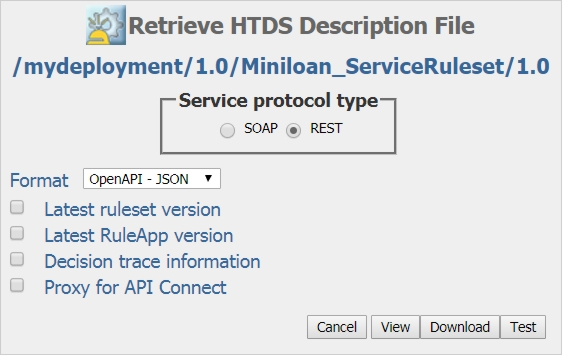

# Task 3: Running the ruleset

You use the HTDS service protocol and JSON format to run the ruleset in the Rule Execution Server console.

You do the following work in this task:
-   Set up a test for the Miniloan Service ruleset.
-   Remove the DecisionID value so that each event gets a unique ID.
-   Enter values to run the ruleset.
-   Run the ruleset to check the results.
-   Run the ruleset with various values to see different results.

To run the Miniloan Service ruleset:

1.   In the Rule Execution Server console, on Miniloan_ServiceRuleset, click **Retrieve HTDS Description File**.
2.   Select the REST service protocol, and then the OpenAPI - JSON format:

 
3.   Click **Test**. 

4.   Replace the proposed values with the following values:

    { "loan": { "amount": 50000, "duration": 240, "yearlyInterestRate": 0.05 },
    "borrower": { "name": "Joe Doe", "creditScore": 600, "yearlyIncome": 8000 } }

**Note**: It is important to remove the DecisionID value. By removing it, a unique ID is generated for each event.

5.   Click **Execute Request**. The Server Response shows that the loan is not approved: 

    .... "approved": false, "messages": [ "Too big Debt-To-Income ratio" ]

6.   Change the values as follows, and click **Execute Request** after entering each set of values. You vary the loan amount from 50,000 to 30,000, the borrower's credit score from 150 to 600, and the borrower's yearly income from 8,000 to 80,000. The different combinations of values produce different results.  

Set 1:

    { "loan": { "amount": 40000, "duration": 240, "yearlyInterestRate": 0.05 },
    "borrower": { "name": "Joe Doe", "creditScore": 150, "yearlyIncome": 8000 } }

Set 2:

    { "loan": { "amount": 30000, "duration": 240, "yearlyInterestRate": 0.05 },
    "borrower": { "name": "Joe Doe", "creditScore": 500, "yearlyIncome": 80000 } }

Set 3:

    { "loan": { "amount": 45000, "duration": 240, "yearlyInterestRate": 0.05 },
    "borrower": { "name": "Joe Doe", "creditScore": 150, "yearlyIncome": 8000 } }

Set 4:

    { "loan": { "amount": 30000, "duration": 240, "yearlyInterestRate": 0.05 },
    "borrower": { "name": "Joe Doe", "creditScore": 500, "yearlyIncome": 80000 } }
 
**Next**

Keep this browser page open to use it in the following tasks. In the next task, you look at the predefined dashboard. 

[**Next task**](../gs_topics/tut_bai_gs_dashboard_lsn.md)

[**Main page**](../README.md)

